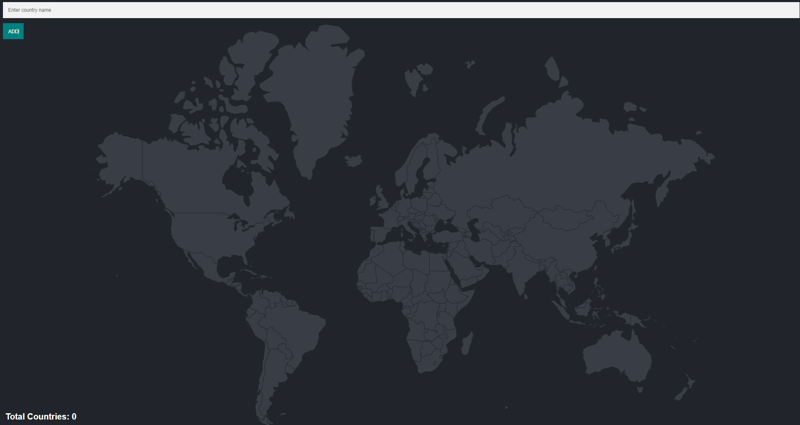
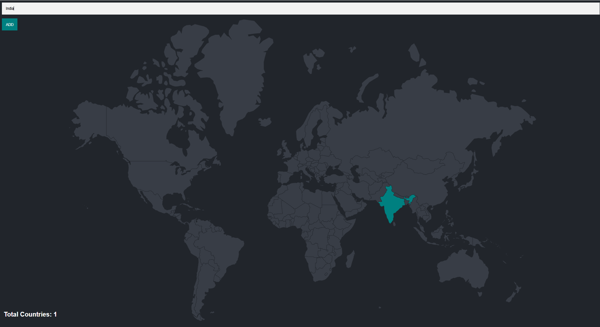
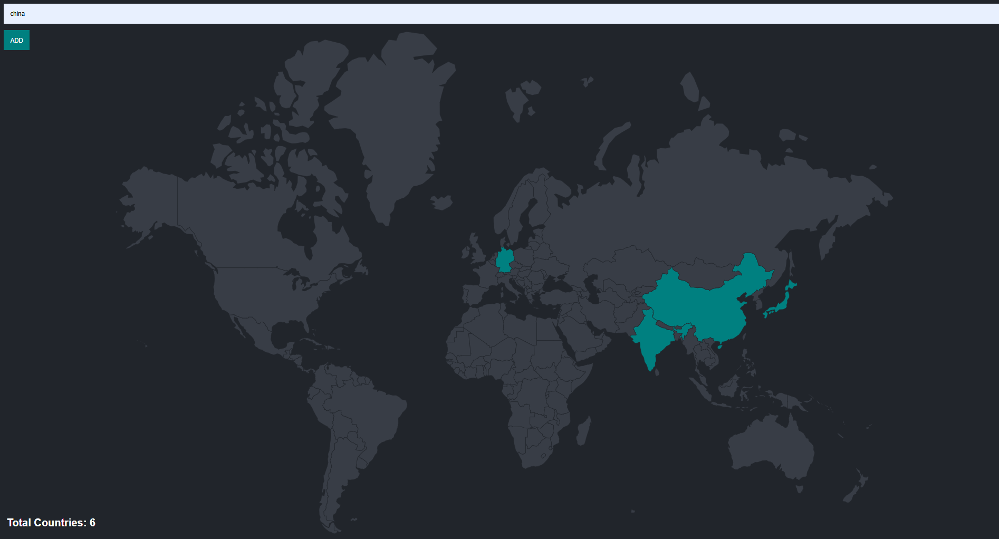

🌍 Travel Tracker
---

The Travel Tracker is a web application that allows users to keep track of the countries they have visited. Users can enter the name of a country, and the app highlights it on a world map. The total number of visited countries is displayed at the bottom, giving travelers a visual representation of their journeys.

_This project is built with Node.js, Express, PostgreSQL, and EJS templates, and styled with CSS. It uses a database to store visited countries and dynamically updates the map based on user input._
---

## 📷 Gallery

| Map| Map|
|--------|--------|
|  |  |

|Map |
|--------|
|  |

---

 1️⃣ Create Table in PostgreSQL(countries visited):
```sql
-- Create the visited_countries table
CREATE TABLE visited_countries (
    id INTEGER PRIMARY KEY,
    country_code CHARACTER(2)
);
```
<br>

 1️⃣ Create Table in PostgreSQL(countries):
```sql
-- Create the countries table
CREATE TABLE countries (
    id INTEGER PRIMARY KEY,
    country_code CHARACTER(2),
    country_name VARCHAR(100)
);
```
2️⃣ Install Dependencies:
```bash
npm i
npm i pg express ejs body-parser
```

3️⃣ Database Connection (index.js)
```bash
const app = express()
const db = new pg.Client({
  user: "postgres",
  host: "localhost",
  database: "XXXXX",    // <-- your database name
  password: "XXXXX",    // <-- your password
  port: XXXX,           // <-- your port name, by default for pg 5432
});
```
4️⃣ Run Server:
```bash
node index.js
```
---
👉 [Open App on Localhost](http://localhost:3000)
